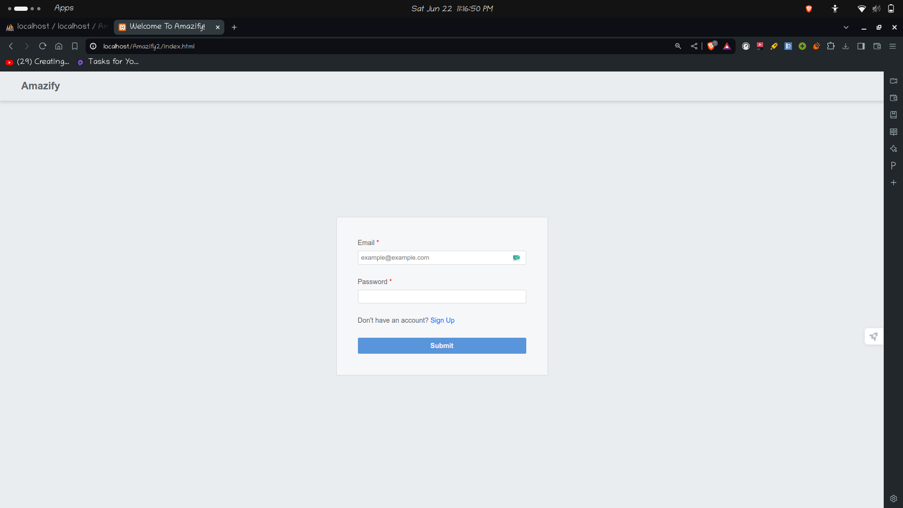
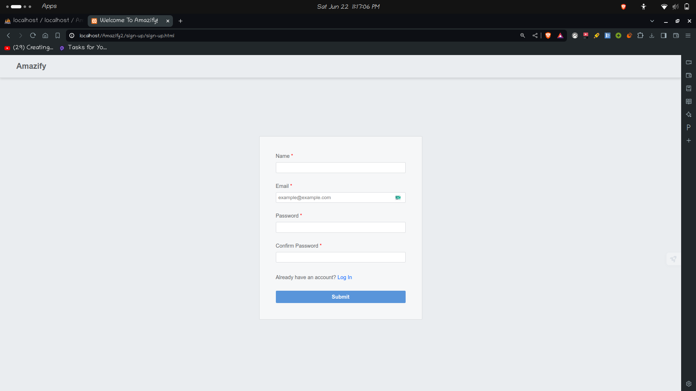
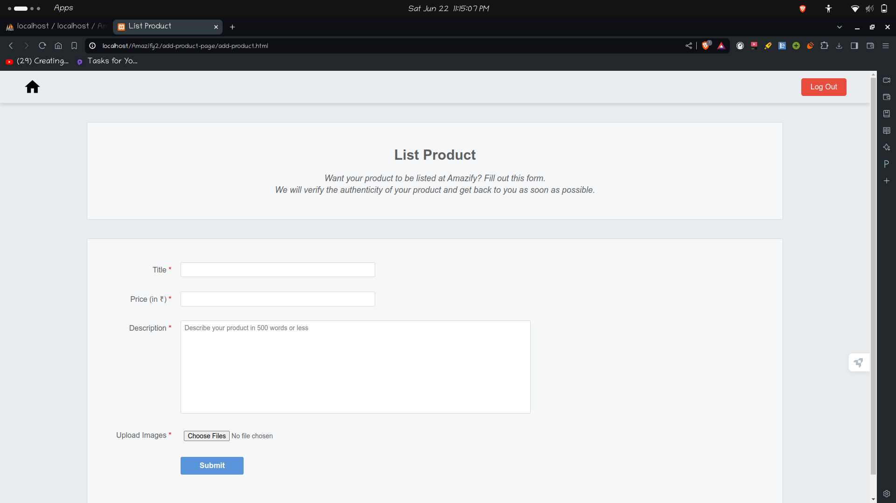
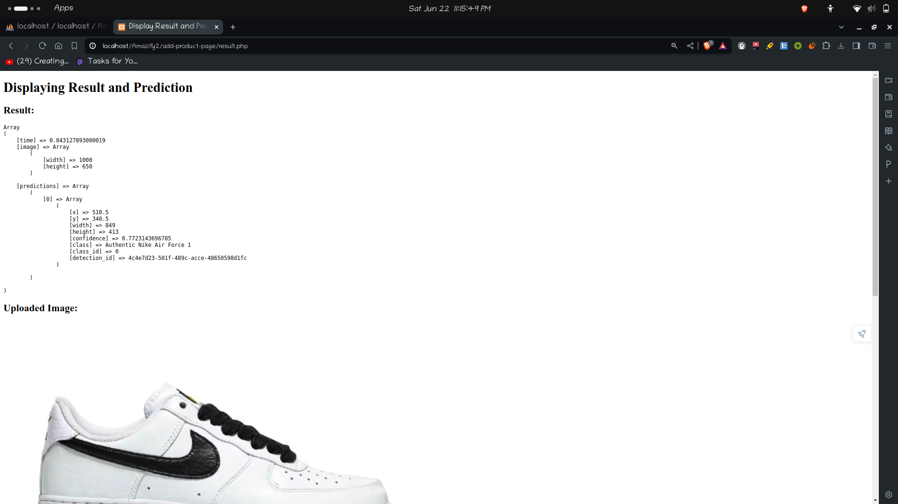
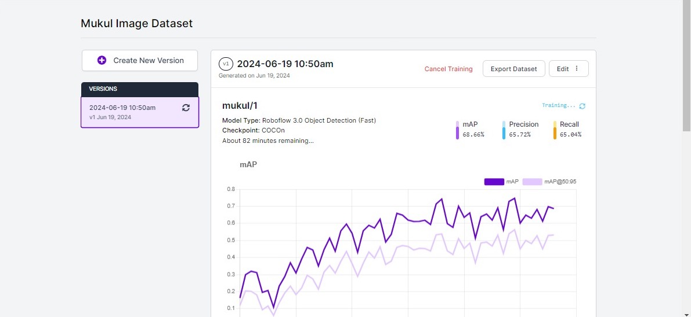
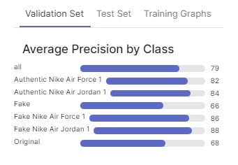
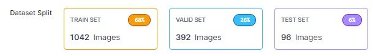
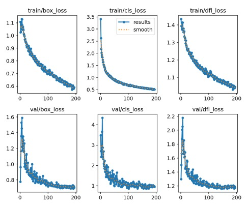

# Amazify

Amazify is a project created under Amazon's event HackOn with Amazon Season 4.

## Description

Amazify provides AI-powered solutions to strengthen counterfeit detection throughout the product lifecycle on the Amazon platform. The overarching objective is to improve the integrity and trustworthiness of the Amazon platform, safeguarding customers from fraudulent activities.

The platform asks sellers to upload a text description and multiple images of their product, and then uses image processing to assign an authenticity score to each product. If the authenticity score satisfies a certain threshold value, the product is accepted and the seller gets a go-ahead to list their product on Amazon.

## Features

- **Image Processing ML Model**: Assigns an authenticity score to products based on uploaded descriptions and images.
- **Product Verification**: Ensures only authentic products are listed on Amazon.
- **Personalized Admin Page**: Sellers can view the status of their products (verified, rejected, or pending).

## Installation

### Prerequisites

- [XAMPP](https://www.apachefriends.org/index.html)

### Setup Steps

1. **Install XAMPP**: Download and install XAMPP on your system.
2. **Copy Files**: Go to the `/opt/lampl/htdocs` folder and copy the Amazify project folder there.
3. **Database Setup**: Run `amazify.sql` in phpMyAdmin to set up the database.
4. **Start the Project**: Open the `index.html` file in the root directory to start the application.

## Usage

1. **Sign Up/Login**: 
   - New users can sign up through the sign-up page.
   - Existing users can log in using their credentials.
2. **Admin Page**: Each seller will have a personalized admin page where they can see the status of their products.
3. **Product Listing**: Sellers can initiate getting a product listed by filling out a form with product details and images. After submission, the product status (verified, rejected, or pending) will be displayed on their admin page.

## Screenshots

### Login Page

### Sign Up Page

### Admin Page

### Product Form

### Accuracy Data

---

For further details, please contact the project contributors.